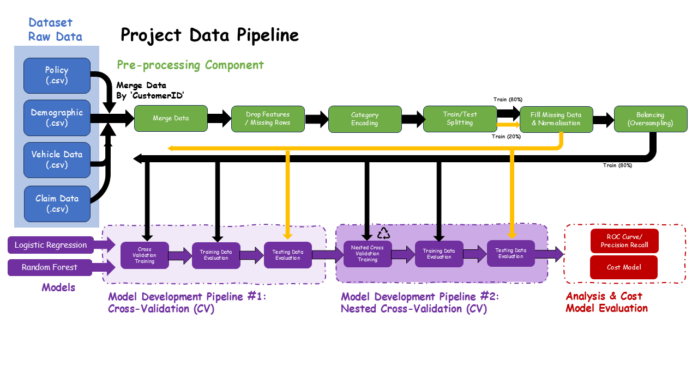
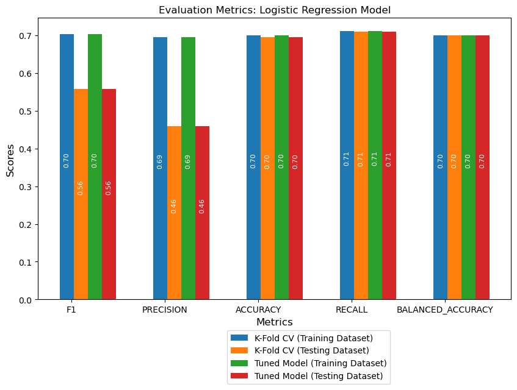
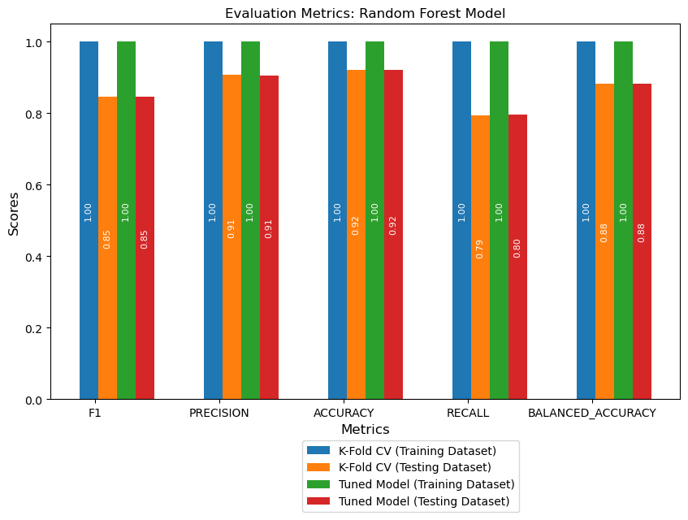
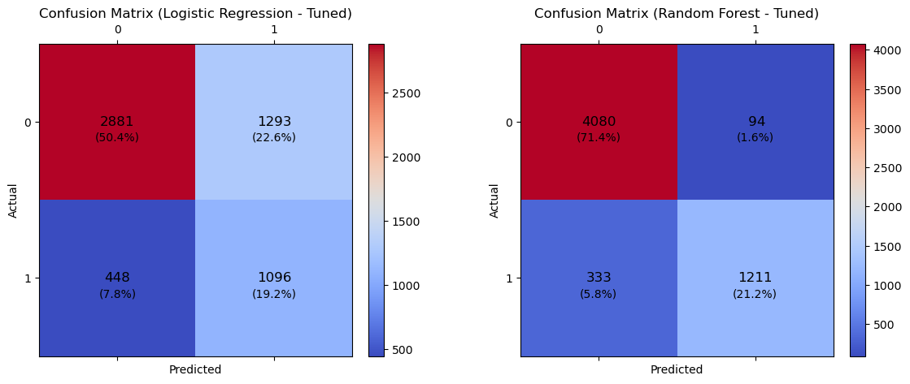
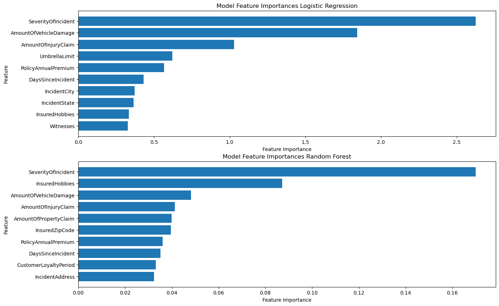
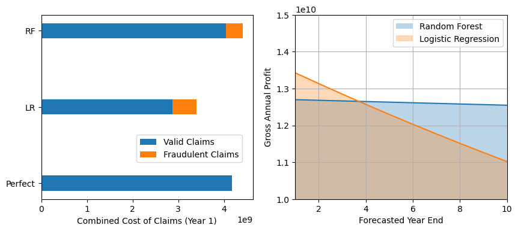

# ML Project - Vehicle Insurance Claim Classification

## Jupyter Notebook

The Jupyter notebooks for the project is located in [ML_Insurance_Claim_Classification.ipyn](ML_Insurance_Claim_Classification.ipynb)

## Aims and Objectives 

The aim of the case study is to develop and propose a machine learning model that can classify fraudulent and valid 
claims for an insurance company using provided assortment of data. The model should achieve target balanced error of 5%, 
that also considers the effects to the profitability and overall business operation.

This will be achieved by completing the following objectives:

- **Obj 1)** merge and pre-process the datasets
- **Obj 2)** evaluate the dataset, including outliers, class imbalance
- **Obj 3)** create a pipeline for training, testing and evalute machine learn models
- **Obj 4)** develop and optimise two machine learning models by training on the pre-processed
- **Obj 5)** develop a cost model using existing data available
- **Obj 6)** evaluate, analyse and propose a recommendation for classification model
- 
The overall structure of the model development is presented below to highlight the structure of the assignment and case study:

### Model development

The company requires the development and evaluation of two models capable of binary classification. An efficient approach
is to use data pipelines to investigate the model's robustness during various data preprocessing and training phases on 
different data subsets, and an attempt to later optimise the overall classification performance through hyperparamter tuning.

### Cost Model Development

For fully evaluating the effect of the model's prediction performance on the business, a cost model is needed to be developed. 
This cost model is based using the existing dataset to predict the annual number of claims, costs due to fraudulent and valid claims
paid out and potentially the impact on losing customers due to losing customers. The information provided is limited, 
so extra information requires to be collected and calculated from the provided dataset (e.g. number of customers,
policy cost, average claim costs)

## MODEL BUILDING

In this section of the case study, two machine learning model were developed to predict fraudulent claims:

1) **Logistic Regression**
2) **Random Forest Classifier**

Both models were trained and evaluated primarily using cross-validation techniques across different subsets of preprocessed 
data. Across both pipelines, **stratified sampling when using K-Fold cross-validation** was used to maintain class balance,
whilst shuffling aims to randomise the order of data presented to the model. The overall cross-validation scores are
obtained for various binary classifier metrics.

## Project Reuslts

### Logistic Regression  Model
The best LR model is now evaluated and the metrics are calculated.

The LR model performance is insufficient across all metrics at classifying claims across both classes. The LR mode
achieves balanced error target of 30%, which is far from the company's target. In particular, the *precision* (46%)
reveals the severity for misclassifying valid claims (FPs).

### Random Forest Model
The best RF model is now evaluated and the metrics are calculated.

The RF model achieves a balanced error rate at 12%, which does not meet the company's requirement target (5%). 
When comparing the weighted averages scores for the RF model across categories: precision (0.93), recall (0.93), F1-Score (0.92)
this reflects the model's overall performance, but is heavily influenced by the larger proportion of non-fraudulent cases
within the dataset.

### Comparison

For further comparison between both tuned LR and RF tuned models, the confusion matrices are plotted for predictions 
on the testing dataset.

 Whilst the performance of the RF model is significantly better than LR model across all metrics, improvements are still
 required to the RF model in order to attain better recall performance i.e. reduce frequency of FNs that are needed to
 minimise the number of fraudulent claims classified is valid.

Evidently, the RF model outperforms the LR model across all metrics, and there are reduced number FPs (22.6% vs 1.6%)
and FNs (7.8% vs 5.8%) that contribute a form of cost or loss of revenue for the business.  Most significantly is the 
inability of the LR model to accurately predict valid claims marked as fraudulent, leading to significant disruption to 
the customer's claims and requiring company resources to investigate. Across both models, the  'recall' score is 
persistently low with a high number of FNs, that are unable to catch fraudulent cases.

### Model Feature Importances
The feature importance plot indicates preferential features when classifying claims and may improve and enhance 
classification performance when training across large datasets in time. Important features are those with the highest
coefficients in a model and are useful for ensuring future datasets contain relevant information. The model features 
contributing the largest coefficients are plotted:

### Model Impact to the Business

The final section reports the anticipated cost and impact to the business profitability forecasted ahead.
The absolute value of all claim type costs are estimated due to prediction errors, using the confusion matrices obtained 
for the RF and LR model for predicted values using the testing dataset.

The final plots comparing the LR and RF models, showing the cost of all claims predicted for Year 1, compared against 
a 'perfect' prediction as a baseline. Also the projected forecast of the gross profit across a ten year window.

##  Conclusions

The Random Forest (RF) is more effective (MISSING) in detecting fraudulent cases (higher TP and lower FN), and significantly 
outperforms LR model when identifying valid claims (higher TNs and lower FPs). The PRC indicates that the RF model has a 
better balance (AUC=missing) between precision and recall when compared to the LR model (*AUC = 0.54*). This ensures 
especially there are fewer FPs (MISSING% vs. 23.5%), that ensures the business can maintain higher customer satisfaction, 
by minimising scrutiny of claims and, operational costs investigating valid claims.

The RF model's recall (80%) is low therefore there remains a significant proportion of fraudulent cases predicted as valid. 
Overall, the RF model balanced error rate is 12%, and shows the model has potential to achieve the company's target 
with further model development to address class imbalance, and acquiring more data from the fraudulent class.

### Business Perspective

Comparing the Logistic Regression model to the Random Forest model, there are greater combined claim cost due to 
increased payouts for all valid and invalid claims. However, long-term maintains profitability is maintained and
surpassed the LR model from Year 4, when assuming customer are not lost due to (FPs) - valid claims flagged as fraudulent. 
Even accounting for simple assumptions to the cost model, the increase cost due to payout of fraudulent claims can be 
compensated by changing the policy prices.

Crucially, the company's reputation and maintaining a long-term customer base can be considered a valuable asset, 
especially as the mean policy loyalty duration is 16.9 years. Beyond the data, the true long-term cost of detecting
valid claims as fraudulent is not known, and higher order effects are not known. If not reduced and managed carefully
could have more severe consequences on the business operations.

### Overall Summary
Additionally, the metrics of each model during the training and testing phase were obtained, and these were careful 
interpreted especially in relation to the overall context of a business, where accuracy alone is insufficient to
determine the performance of a machine learning model.
